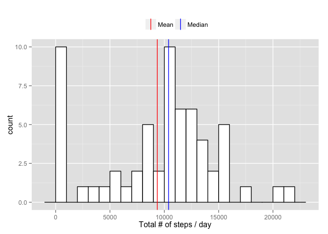
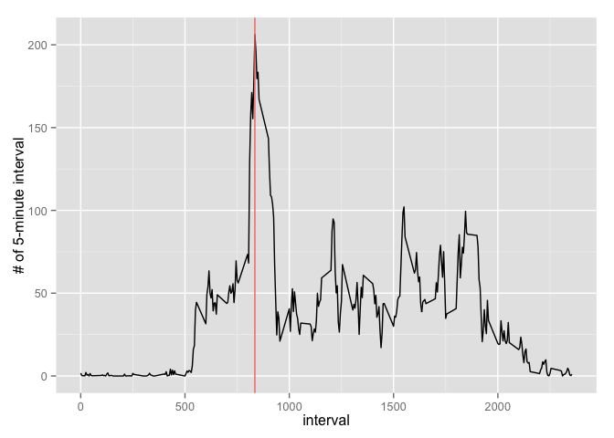
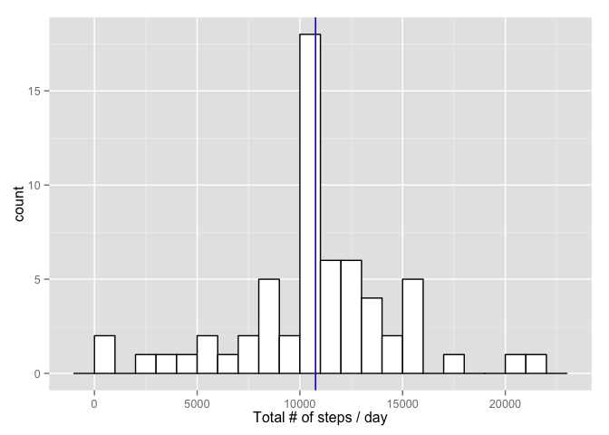
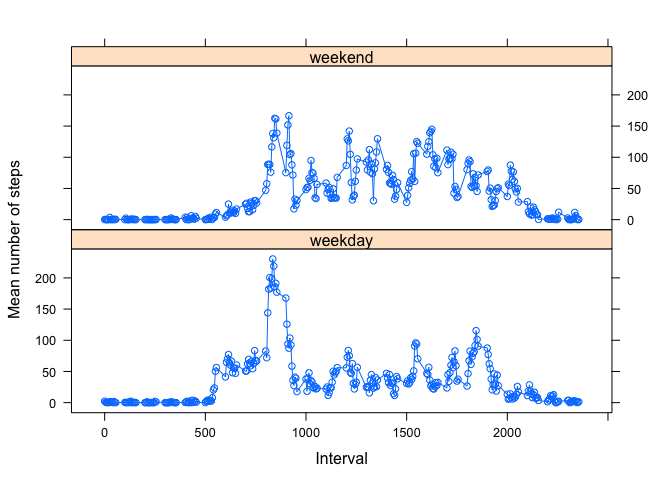

# Reproducible Research: Peer Assessment 1


```r
library(plyr)
library(ggplot2)
```

## Loading and preprocessing the data

We first load the data from its CSV source file.


```r
setwd('/Users/davidr/Projekte/software/problems/coursera/repro/week12/RepData_PeerAssessment1/')
df.raw <- read.csv('activity.csv')
```


## What is mean total number of steps taken per day?

We calculate the the total number of steps taken each day and calculate the mean and median for this new dataset. *Note*: The assignment explicitly asks to ignore missing values for now. This introduces days with 0 steps that will bias the mean and median values.


```r
df.stepsPerDay <- ddply(df.raw, .(date), summarize, total=sum(steps, na.rm = TRUE))
meansteps <- mean(df.stepsPerDay$total)
mediansteps <- median(df.stepsPerDay$total)
```

We find that the mean number of steps per day is 9354.2295082 and the median value is 10395.  
We plot a histogram of total steps taken each day:


```r
v <- data.frame(values = rbind(meansteps, mediansteps))
ggplot(df.stepsPerDay, aes(x=total)) + 
    geom_histogram(      # Histogram with density instead of count on y-axis
                   binwidth=1000,
                   colour="black", fill="white") +
  geom_vline(data=v, aes(xintercept = values, color = rownames(v)), show_guide = TRUE) + 
  xlab("Total # of steps / day") + 
 scale_colour_manual(values=c("red","blue"), labels = c('Mean', 'Median')) +
  theme(legend.position = "top", legend.title=element_blank())
```

 

## What is the average daily activity pattern?

Calcualte averages for each interval and find the maximum value.


```r
df.stepsInterval <- ddply(df.raw, .(interval), summarize, average=mean(steps, na.rm = TRUE))
df.stepsInterval.max <- df.stepsInterval[df.stepsInterval$average == max(df.stepsInterval$average),]
interval_max <- df.stepsInterval.max$interval
steps_max <- df.stepsInterval.max$average
meansteps.interval <- mean(df.stepsInterval$average)
```

The interval with the most number of steps is Interval 835 with 206.1698113 steps (compared to 37.3825996 on average in the intervals).


```r
ggplot(df.stepsInterval)+geom_line(aes(x = interval, y = average))+
  geom_vline(data=df.stepsInterval.max, aes(xintercept=interval, color="Red"))+
  ylab("# of 5-minute interval")
```

 

## Imputing missing values

We replace missing values with the mean value for that particular interval.


```r
missing_rows <- sum(is.na(df.raw$steps))
# This approach comes from http://stackoverflow.com/questions/9322773/how-to-replace-na-with-mean-by-subset-in-r-impute-with-plyr

impute.mean <- function(x) replace(x, is.na(x), mean(x, na.rm = TRUE))
df.imputed <- ddply(df.raw, ~ interval, transform, steps = impute.mean(steps))
```

2304 have missing values.


```r
df.stepsPerDay.im <- ddply(df.imputed, .(date), summarize, total=sum(steps, na.rm = TRUE))
meansteps.im <- mean(df.stepsPerDay.im$total)
mediansteps.im <- median(df.stepsPerDay.im$total)

v <- data.frame(values = rbind(meansteps.im, mediansteps.im))
ggplot(df.stepsPerDay.im, aes(x=total)) + 
    geom_histogram(      # Histogram with density instead of count on y-axis
                   binwidth=1000,
                   colour="black", fill="white") +
  geom_vline(data=v, aes(xintercept = values, color = c("red","blue"), show_guide = TRUE)) + 
  xlab("Total # of steps / day") + 
 scale_colour_manual(values=c("red","blue"), labels = c('Mean', 'Median')) +
  theme(legend.position = "top", legend.title=element_blank())
```

 

The median value now is 1.0766189\times 10^{4} and the mean value is 1.0766189\times 10^{4} - they are equal!
The mean has shifted upward. This was expected as we now have more steps in the dataset.

## Are there differences in activity patterns between weekdays and weekends?

Wrangle the data first. We split by weekend/weekday and by interval and then calculate the mean number of steps. We use the imputed data.


```r
df.imputed$weekdays <- as.factor(weekdays(as.Date(df.imputed$date)))

weekendfunction <- function(x){
 if(x == 'Sonntag' | x == 'Samstag') return('weekend')
 return('weekday')
}
weekendfunction <- Vectorize(weekendfunction)
df.weekended <- ddply(df.imputed, ~ weekdays, transform, weekendflag = weekendfunction(weekdays))

df.meansteps.weekended <- ddply(df.weekended, c("interval", "weekendflag"), summarise, meansteps = mean(steps))
```

And plot


```r
library(lattice)
xyplot(df.meansteps.weekended$meansteps~df.meansteps.weekended$interval|df.meansteps.weekended$weekendflag, type=c("p", "l"), layout=c(1,2), xlab="Interval", ylab="Mean number of steps")
```

 
